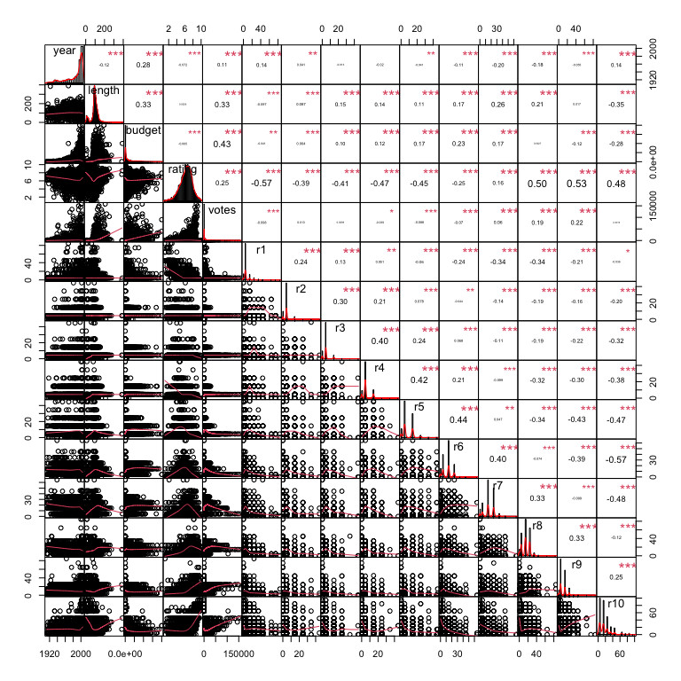
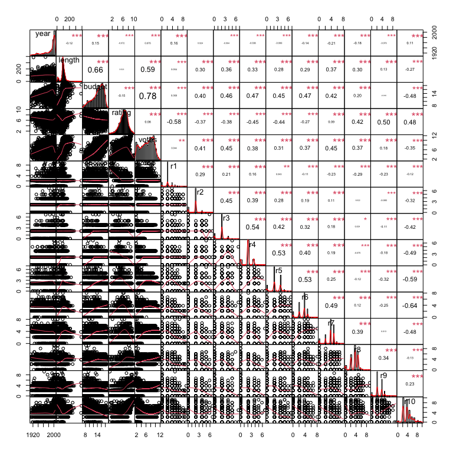
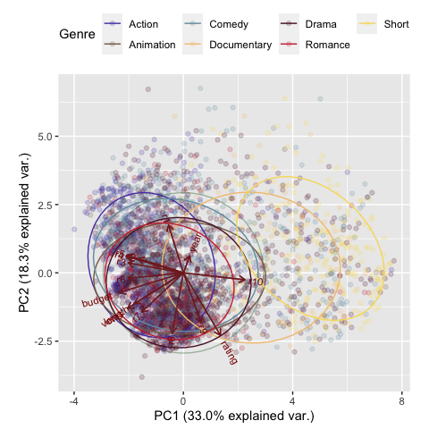

*Dimensionality reduction* is a way that we can make sense of high-dimensional
data. With dimensionality reduction, we're taking multivariate data that live in
a higher-dimensional space and transforming it into a lower-dimensional
representation. From there, we can use the lower-dimensional representation to
visualize or analyze our data.

In this tutorial, we will be focusing on *principal components analysis* (PCA).
PCA is a linear dimensionality reduction method that focuses on retaining the
maximal amount of variance from the original data in the new (lower-dimensional)
data. PCA decomposes the original data's variance into a series of orthogonal
dimensions (or *principal components*), with each subsequent dimension
explaining less variance in the data.

An this tutorial, we will be using base R to conduct PCA. As a sample dataset,
we'll be using the `movies` dataset from the `ggplot2movies` library.

My thanks go to [Luke Hayden's "Principal Components Analysis in R"
tutorial](https://www.datacamp.com/community/tutorials/pca-analysis-r), from
which I learned about the `ggbiplot` library.

***

# Preliminaries

First, let's get ready for our analyses. We do this by clearing our workspace
and loading in the libraries we'll need. It's good to get in the habit of 
clearing your workspace from the start so that you don't accidentally have
clashes with unneeded variables or dataframes that could affect your results.

As with our other tutorials, we'll use a function here to check for all required
packages and---if necessary---install them before loading them. Implementing
this (or a similar) function is a helpful first step, especially if you plan on
sharing your code with other people.


```r
# clear the workspace (useful if we're not knitting)
rm(list=ls())

# turn on caching
knitr::opts_chunk$set(cache=TRUE, autodep=TRUE, cache.lazy=FALSE)

# set seed for reproducibility
set.seed(001)
```


```r
# specify which packages we'll need
required_packages = c("tidyverse",
                      "stringr",
                      "ggplot2",
                      "ggplot2movies",
                      "PerformanceAnalytics",
                      "Hmisc",
                      "devtools")

# install them (if necessary) and load them
load_or_install_packages(required_packages)

# install from GitHub
if (length("ggbiplot")) { install_github("vqv/ggbiplot") }
if(length("inauguration")) { install_github("ciannabp/inauguration", ref="main") }
library(ggbiplot)
library(inauguration)
```

***

# Data preparation

***

## Load the data


```r
# let's take a peek at what we get
head(movies)
```

```
## # A tibble: 6 x 24
##   title  year length budget rating votes    r1    r2    r3    r4    r5    r6
##   <chr> <int>  <int>  <int>  <dbl> <int> <dbl> <dbl> <dbl> <dbl> <dbl> <dbl>
## 1 $      1971    121     NA    6.4   348   4.5   4.5   4.5   4.5  14.5  24.5
## 2 $100…  1939     71     NA    6      20   0    14.5   4.5  24.5  14.5  14.5
## 3 $21 …  1941      7     NA    8.2     5   0     0     0     0     0    24.5
## 4 $40,…  1996     70     NA    8.2     6  14.5   0     0     0     0     0  
## 5 $50,…  1975     71     NA    3.4    17  24.5   4.5   0    14.5  14.5   4.5
## 6 $pent  2000     91     NA    4.3    45   4.5   4.5   4.5  14.5  14.5  14.5
## # … with 12 more variables: r7 <dbl>, r8 <dbl>, r9 <dbl>, r10 <dbl>,
## #   mpaa <chr>, Action <int>, Animation <int>, Comedy <int>, Drama <int>,
## #   Documentary <int>, Romance <int>, Short <int>
```

## Create a new variable for genre

The `movies` dataset allows for a given movie to include multiple genres, but
for our example, we want to create a genre variable that's mutually exclusive.
Here, we'll use the given genre label if there is only one listed and will
randomly select one genre label if there are multiple listed.


```r
movies_df = movies %>%
  
  # use `gather()` to figure out the genre identifications for each
  gather(., genre, present, 
         Action,Animation,Comedy,Drama,Documentary,Romance,Short) %>%
  
  # remove lines for which a given genre isn't present
  dplyr::filter(present!=0) %>%
  
  # keep only one (randomly chosen) genre for each 
  # (since they're alphabetically ordered)
  dplyr::group_by(title) %>%
  sample_n(1) %>%
  ungroup() %>%
  
  # drop `present` variable
  dplyr::select(-present) %>%
  
  # convert to factor
  mutate(genre = as.factor(genre))
```

## Identify variables for reduction

We've got plenty of data, but with PCA, we know that we need to use continuous
or ordinal variables. Let's grab only the variables that have those properties.
Let's also go ahead and eliminate observations with missing data, too, while
we're at it. We'll also include `genre`, which we'll use for visualization
purposes later.


```r
movies_df = movies_df %>% ungroup() %>%

  # select only numeric variables
  dplyr::select(genre, 
                where(is.numeric)) %>%
  
  # remove rows with missing values
  drop_na() 
```

Let's see how our data look.


```r
# use the built-in summary option
summary(movies_df)
```

```
##          genre           year          length           budget         
##  Action     : 527   Min.   :1903   Min.   :  1.00   Min.   :        0  
##  Animation  :  74   1st Qu.:1979   1st Qu.: 87.00   1st Qu.:   300000  
##  Comedy     :1122   Median :1997   Median : 98.00   Median :  3500000  
##  Documentary: 101   Mean   :1987   Mean   : 96.04   Mean   : 14631286  
##  Drama      :1648   3rd Qu.:2002   3rd Qu.:113.00   3rd Qu.: 17950000  
##  Romance    : 341   Max.   :2005   Max.   :390.00   Max.   :200000000  
##  Short      : 270                                                      
##      rating           votes              r1               r2        
##  Min.   : 1.000   Min.   :     5   Min.   : 0.000   Min.   : 0.000  
##  1st Qu.: 5.400   1st Qu.:    70   1st Qu.: 4.500   1st Qu.: 4.500  
##  Median : 6.400   Median :   794   Median : 4.500   Median : 4.500  
##  Mean   : 6.303   Mean   :  5392   Mean   : 7.193   Mean   : 4.531  
##  3rd Qu.: 7.300   3rd Qu.:  5518   3rd Qu.: 4.500   3rd Qu.: 4.500  
##  Max.   :10.000   Max.   :157608   Max.   :84.500   Max.   :44.500  
##                                                                     
##        r3               r4               r5               r6       
##  Min.   : 0.000   Min.   : 0.000   Min.   : 0.000   Min.   : 0.00  
##  1st Qu.: 4.500   1st Qu.: 4.500   1st Qu.: 4.500   1st Qu.: 4.50  
##  Median : 4.500   Median : 4.500   Median : 4.500   Median :14.50  
##  Mean   : 4.663   Mean   : 5.572   Mean   : 8.079   Mean   :11.94  
##  3rd Qu.: 4.500   3rd Qu.: 4.500   3rd Qu.:14.500   3rd Qu.:14.50  
##  Max.   :45.500   Max.   :44.500   Max.   :45.500   Max.   :64.50  
##                                                                    
##        r7              r8              r9             r10        
##  Min.   : 0.00   Min.   : 0.00   Min.   : 0.00   Min.   :  0.00  
##  1st Qu.:14.50   1st Qu.: 4.50   1st Qu.: 4.50   1st Qu.:  4.50  
##  Median :14.50   Median :14.50   Median : 4.50   Median : 14.50  
##  Mean   :15.77   Mean   :14.88   Mean   :10.12   Mean   : 18.56  
##  3rd Qu.:24.50   3rd Qu.:24.50   3rd Qu.:14.50   3rd Qu.: 24.50  
##  Max.   :64.50   Max.   :84.50   Max.   :84.50   Max.   :100.00  
## 
```
Based on what we know about movies, it looks like some of our data may be
suspect: Some movies have a `budget` value of `0`. Unless we know that these
are entirely volunteer efforts (which, at this point, we don't), let's go
ahead and remove them, assuming that the data may be incorrect.


```r
# remove films with $0 budgets
movies_df = movies_df %>%
  dplyr::filter(budget > 0)
```

Now, let's take a look at the properties of our variables. Remember, we want to
make sure that our data are normally distributed and are linearly related to one
another.


```r
# give us a fabulous table (minus the `genre` variable)
chart.Correlation(select(movies_df,
                         -genre), 
                  histogram=TRUE, pch=19)
```

<!-- -->

PCA is robust to some non-normality, but we need to be cautious. It looks like
we've got a few variables that should be transformed. There are different ways
that we can transform our variables: taking the square root (`sqrt()`), taking
the square (`^2`), and taking the natural logarithm (`log()`).


```r
# transform our variables
movies_df = movies_df %>%
  
  # take the log of some variables
  mutate(budget = log(budget),
         votes = log(votes)) %>%
  
  # take the square root of other variables
  mutate_at(vars(r1,r2,r3,r4,r5,r6,r7,r8,r9,r10),
            list(sqrt))

# then let's see those lovely tables again
chart.Correlation(select(movies_df,
                         -genre), 
                  histogram=TRUE, pch=19)
```

<!-- -->

The visualization is all well and good, but in a real dataset, we'd want
to test for normality statisically.

**Try this on your own**. Use the `shapiro.test()` function to test for
normality. If you find that the variables are not close to being normally
distributed after you transform them, you need to think carefully about what
this means.

**Another point to consider**. Remember that PCA assumes that our variables are
linearly related. Does that point hold in our current choice for a dataset? If
not, how would you handle this?

# Conduct PCA

Generally speaking, a correlation matrix is preferred to the covariance
matrix. The correlation matrix requires all variables to be on the same scale,
but we don't have that by default in this dataset. Luckily, `prcomp()` handles
this for us with the `center` and `scale.` options.


```r
# separate out genres
movie_genres = movies_df$genre

# conduct PCA
movies_pca = prcomp(select(movies_df,
                           -genre), 
                    center = TRUE, scale. = TRUE)

# see what we get
summary(movies_pca)
```

```
## Importance of components:
##                           PC1    PC2    PC3     PC4     PC5     PC6     PC7
## Standard deviation     2.2264 1.6559 1.2546 1.01906 0.89043 0.80081 0.76162
## Proportion of Variance 0.3305 0.1828 0.1049 0.06923 0.05286 0.04275 0.03867
## Cumulative Proportion  0.3305 0.5133 0.6182 0.68744 0.74030 0.78305 0.82172
##                            PC8     PC9    PC10    PC11    PC12    PC13    PC14
## Standard deviation     0.72299 0.66876 0.64717 0.61773 0.59310 0.49651 0.42737
## Proportion of Variance 0.03485 0.02982 0.02792 0.02544 0.02345 0.01643 0.01218
## Cumulative Proportion  0.85657 0.88639 0.91431 0.93975 0.96320 0.97963 0.99181
##                           PC15
## Standard deviation     0.35053
## Proportion of Variance 0.00819
## Cumulative Proportion  1.00000
```
We have 15 components in our dataset, one for every variable in our dataset.
You'll also see how much independent variance each component is contributing
(`Proportion of Variance`). Remember, the first principal component ("PC") is
always going to "soak up" the most amount of variance, and each subsequent
component will "soak up" less and less variance.


```r
# plot the components!
component_plot = ggbiplot(movies_pca, obs.scale = 1, var.scale = 1,
                          groups = movie_genres, ellipse = TRUE, circle = TRUE,
                          alpha=.2) +
  scale_colour_manual(name = 'Genre',
                      values=inauguration_palettes$inauguration_2021_bernie) +
  theme(legend.direction = 'horizontal', legend.position = 'top')

# reorder layers so that the arrows are on top
# (thanks to https://stackoverflow.com/a/34135575)
component_plot$layers <- c(component_plot$layers, 
                           component_plot$layers[[2]])

# display plot
component_plot
```

<!-- -->
